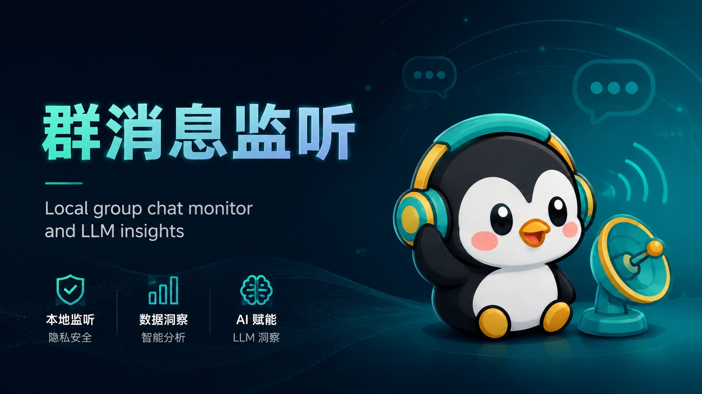
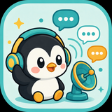
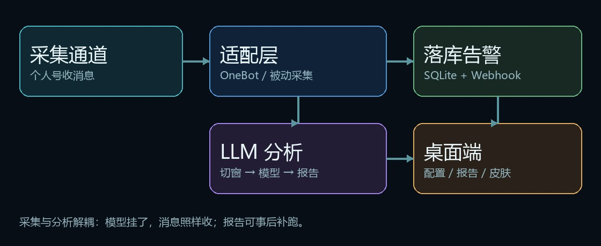

<p align="center">
  
</p>

<p align="center">
  
</p>

<h1 align="center">群消息监听</h1>

<p align="center">
  <b>本机群聊雷达</b> · 实时落库 · 关键词告警 · LLM 结构化洞察<br/>
  <sub>不向目标群拉机器人 · 用你已在群里的个人号收消息</sub>
</p>

<p align="center">
  
  
  
  
  
</p>

---

群里信息太多，翻记录太累？  
**群消息监听**把「听到的话」变成可检索的本地数据，再让大模型帮你提炼：这段时间聊了什么、有没有风险、该跟进什么。

| 你想要的 | 它怎么给 |
|----------|----------|
| 不错过关键群消息 | NapCat / OneBot 实时推送，或官方 QQ 被动兜底 |
| 事后还能翻 | SQLite 去重落库，媒体可本地缓存 |
| 关键词别漏 | 命中即 Webhook（飞书 / 钉钉友好） |
| 快速看懂一场讨论 | 定时 / 手动 LLM 报告：要点、风险、名词剖析、深入分析、追问 |
| 用着舒服 | Tauri 桌面端 + 多套氛围皮肤 |

<p align="center">
  
</p>

---

## 一眼看懂架构

<p align="center">
  
</p>

**采集与分析解耦**：模型挂了，消息照样收；报告可以事后补跑。  
数据默认留在本机 `data/`；只有你主动配置的 LLM API 才会收到分析用的文本。

```text
QQ 群（个人号）
   └─ NapCat / 被动采集
        └─ 过滤 · 日志 · SQLite · Webhook
             └─（可选）LLM 切窗总结 → 报告
                  └─ Tauri 桌面端查看 / 追问 / 收藏
```

---

## 界面与皮肤

桌面端不只是「能用」，还把长时间盯群这件事做得更耐看：图片皮肤、纯色板、自定义取色都有。

<p align="center">
  
</p>

<details>
<summary>单独预览内置氛围壁纸</summary>

| 午夜港湾 | 灯火港 |
|:---:|:---:|
|  |  |
| **暮色窗** | **竹影** |
|  |  |

</details>

应用图标（桌面端同款）：

<p align="center">
  
</p>

---

## 5 分钟上手

### 推荐：桌面端

```powershell
cd D:\project\group-msg-monitor

# Python（监控服务）
python -m venv .venv
.\.venv\Scripts\Activate.ps1
pip install -r requirements.txt

# 桌面 UI（也可双击 start-desktop.bat）
cd desktop
npm install
npm run tauri dev
```

**建议第一次这样走：**

1. **总配置** → 填 OneBot 地址 / Token（或切换 QQ 被动模式）  
2. 添加一个 **LLM Provider**（通义 / DeepSeek / Ollama 等 OpenAI 兼容接口）  
3. **群列表** → 打开目标群的「监听」，按需打开「LLM」  
4. **实时监控** → 启动服务，群里发条消息确认进流  
5. 群配置里点 **立即分析**，到报告页看结构化结果  

| 脚本 | 用途 |
|------|------|
| `start-desktop.bat` | 启动桌面端 |
| `start-monitor.bat` | 只跑 Python 监控 |
| `start-napcat.bat` | 启停 NapCat（路径按本机修改） |

### 也可以：纯命令行

```powershell
copy .env.example .env
# 编辑 ONEBOT_WS_URL / ONEBOT_ACCESS_TOKEN
python -m app.main
```

配置优先级：`环境变量 > .env > config.yaml > 默认值`。  
分群开关、模型、皮肤以桌面写入的本地 JSON 为准（已 gitignore）。

### NapCat（推荐采集方式）

1. 安装 [NapCatQQ](https://napneko.github.io)，用**已在群内**的号登录  
2. 正向 WebSocket 绑定 **`127.0.0.1`**，Token 与桌面总配置一致  
3. **不要**把 OneBot 端口映射到公网  

```json
{
  "network": {
    "websocketServers": [{
      "name": "ws-monitor",
      "enable": true,
      "host": "127.0.0.1",
      "port": 3001,
      "token": "与桌面 / .env 相同",
      "messagePostFormat": "string",
      "reportSelfMessage": false,
      "heartInterval": 30000
    }]
  }
}
```

> **官方 QQ 被动模式**：不 Hook、不走私有协议，靠通知 + UI Automation。静音群 / 关通知可能漏消息，适合兜底，不建议当唯一生产路径。

---

## 功能清单

| 模块 | 能力 |
|------|------|
| **采集** | OneBot 实时；QQ 被动兜底；进程单例锁防多开 |
| **存储** | SQLite 去重；图片等媒体本地缓存 |
| **告警** | 分群关键词 + Webhook |
| **LLM** | 定时 / 手动总结；多轮补上下文；追问与本地收藏；超时退避重试 |
| **桌面** | 实时流、分群配置、报告卡片、收藏夹、氛围皮肤 |
| **实验通道** | 微信 / Telegram 代码保留，**默认关闭** |

LLM 设计说明 → [`docs/LLM聊天总结与分析设计.md`](docs/LLM聊天总结与分析设计.md)

---

## 环境要求

| 组件 | 说明 |
|------|------|
| Windows 10/11 | 桌面端与 QQ 被动以 Windows 为主 |
| Python 3.11+ | 监控与分析服务 |
| Node.js 18+ | 桌面前端 |
| Rust / Tauri 前置 | 首次 `tauri dev` 需要 |
| NapCat 或官方 QQ | 取决于你选的采集模式 |

```powershell
.\.venv\Scripts\Activate.ps1
python -m unittest discover -s tests -v
```

---

## 目录速览

```text
group-msg-monitor/
├── docs/readme/          # README 配图（图标 / 皮肤 / 架构）
├── app/                  # Python：采集 · 落库 · LLM
├── desktop/              # Tauri 桌面端
├── scripts/              # 桌面 API、被动探针、诊断
├── tests/
├── data/ · logs/         # 本地数据（gitignore）
└── start-*.bat
```

---

## 验收小抄

| 场景 | 预期 |
|------|------|
| 目标群发言 | 数秒内出现在桌面消息流 / 日志 |
| Token 错误 | OneBot 连不上或鉴权失败 |
| NapCat 重启 | 自动退避重连 |
| 手动 LLM | 后台跑完出报告；偶发超时会重试 |

---

## 免责声明

1. **非官方**：与腾讯 QQ、各 IM 厂商及模型服务商无隶属关系。NapCat 等社区协议端存在账号风控可能，请自担风险。  
2. **合规自用**：仅可在你有权监听的场景使用，禁止窃听、骚扰或侵害他人权益。  
3. **隐私**：消息默认本机存储；启用云端 LLM 即表示相关文本会发往你配置的 API。  
4. **不保证**：漏消息、分析失误、服务中断均可能发生；软件按「现状」提供。  
5. **安全建议**：专用小号、只收不发；OneBot 仅本机回环；勿公网暴露。  
6. 继续使用即视为已阅读并同意上述条款。开发维护者不对账号、数据或业务损失承担责任。

---

## 延伸阅读

| 文档 | 内容 |
|------|------|
| [`QQ群消息实时监控方案大纲.md`](QQ群消息实时监控方案大纲.md) | 选型与约束 |
| [`docs/LLM聊天总结与分析设计.md`](docs/LLM聊天总结与分析设计.md) | 分析层设计 |
| [`desktop/README.md`](desktop/README.md) | 桌面端开发 |

---

<p align="center">
  
  <br/>
  <sub>戴上耳机的小企鹅，帮你听一听群里正在发生什么。</sub>
</p>
